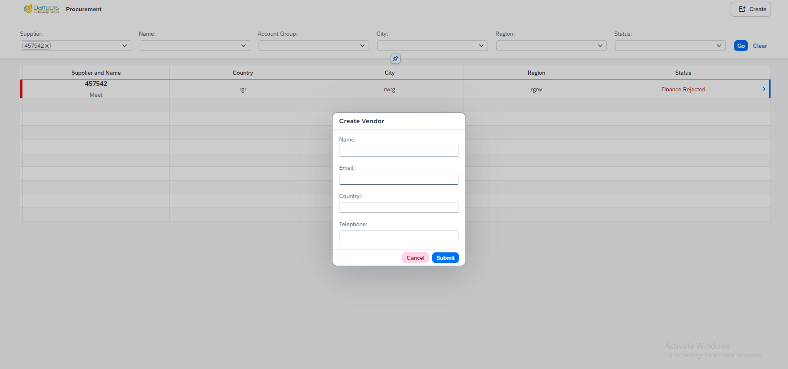
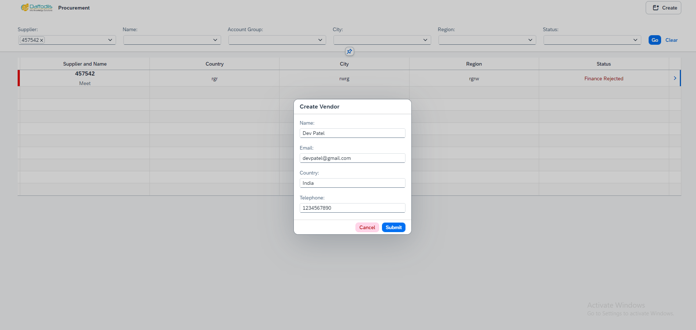
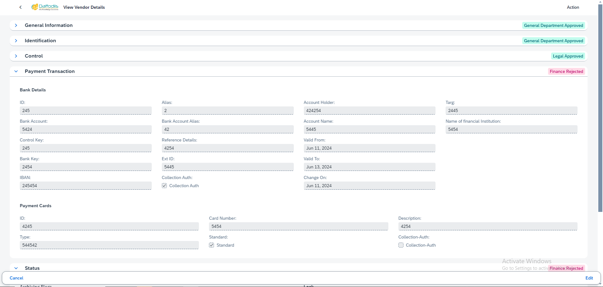

# Vendor-Portal
manage vendor details
## View the Vendor Details
 

## Search partially to the vendor details 

 

## Create a new vendor then submit it and vendor get a application link for fill other information.

 

## After vendor fill all the details and then show the detail in the table

## If you want to see the vendor details click on the navigation button in the table of the particular department .

